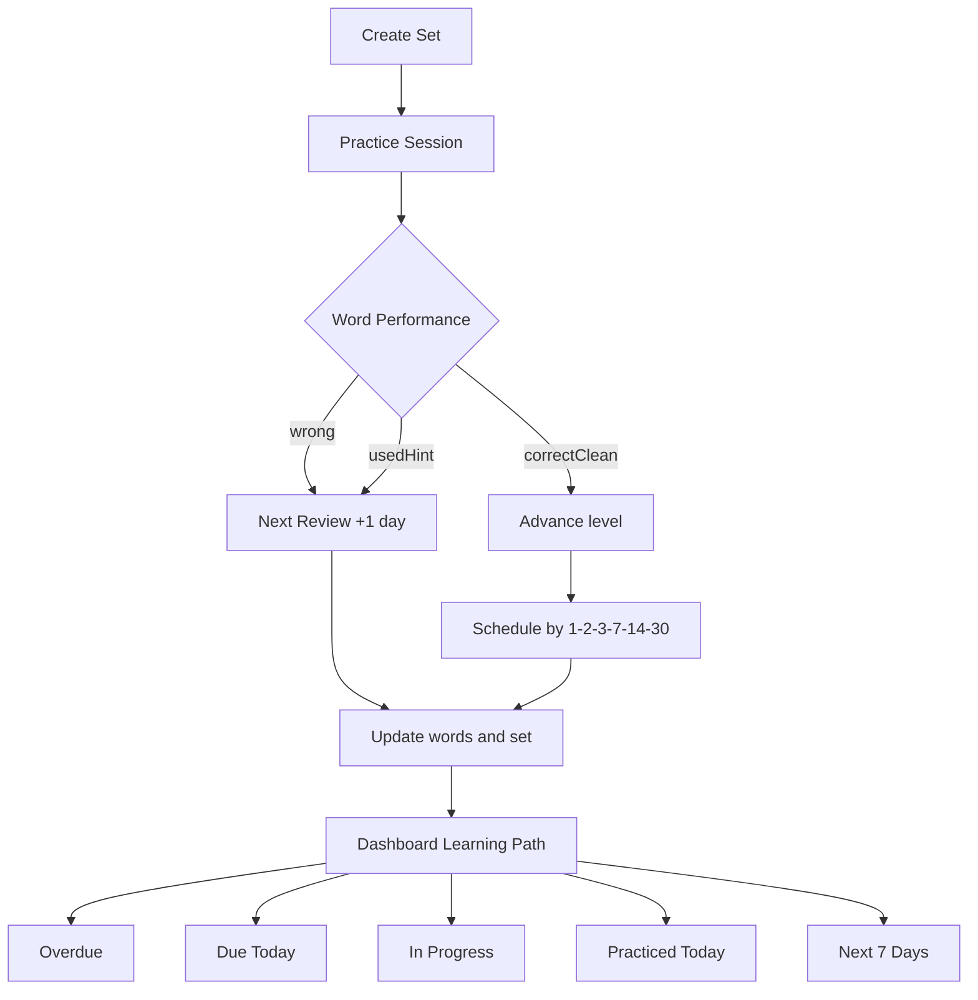

# Learning Path v1 (Pilot)

## Muc tieu

- Chuan hoa lich on de HS de theo doi: `1-2-3-7-14-30`.
- Hien thi ro lo trinh hoc hang ngay tren dashboard.
- Tach bach trang thai: can on ngay, dang luyen, da luyen, ke hoach sap toi.

## Pham vi trien khai

### 1) Scheduling

- File: `src/lib/spacedRepetition.ts`
- Quy tac moi cho `correctClean` theo `reviewLevel`:
  - level `0` -> `+1 ngay`
  - level `1` -> `+2 ngay`
  - level `2` -> `+3 ngay`
  - level `3` -> `+7 ngay`
  - level `4` -> `+14 ngay`
  - level `>=5` -> `+30 ngay`
- Neu `wrong` hoac `usedHint` -> `+1 ngay` de on lai som.

### 2) Learning Path Dashboard

- File: `src/app/dashboard/page.tsx`
- Bo sung cac khoi:
  - `Qua han`
  - `Den han hom nay`
  - `Da luyen hom nay`
  - `Set dang luyen`
  - `Ke hoach 7 ngay toi`
- Van giu khoi `Can on hom nay` (theo `dueSummaries`) de hien so tu den han.

## Data va mapping hien tai

- Nguon du lieu chinh:
  - `sets.nextReviewAt`
  - `sets.lastPracticedAt`
  - `sets.status` (`new | learning | reviewing | completed`)
  - `words.nextReviewAt` (duoc tong hop qua `getDueSetSummaries`)
- Khong doi schema Firestore trong pilot nay.

## Draw Flow

## UX ky vong

- HS vao dashboard se biet ngay:
  - viec can lam ngay (`Qua han`, `Den han hom nay`)
  - viec dang lam (`Set dang luyen`)
  - tien do trong ngay (`Da luyen hom nay`)
  - tai hoc sap toi (`Ke hoach 7 ngay toi`)

## Rui ro va ghi chu

- `upcomingSets` dang dua tren `set.nextReviewAt` (moc som nhat cua set), chua chi tiet theo tung tu.
- Chua co trend chart theo ngay/tuan (chi moi card tong hop).
- Chua bo sung test tu dong cho mapping schedule va dashboard buckets.

## Goi y buoc tiep theo

- Them unit test cho `calculateNextReview`.
- Them section "qua han bao nhieu ngay" de uu tien set can cuu gap.
- Them daily goal (vi du: so set hoac so tu can xong moi ngay).
